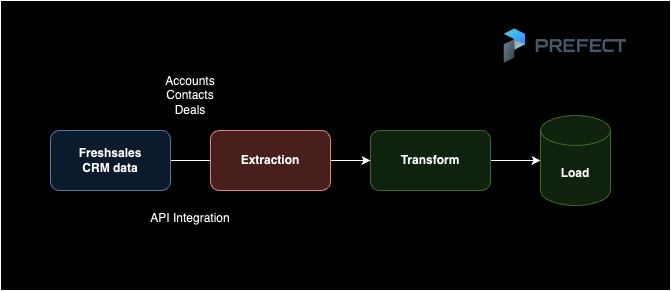

<!-- ABOUT THE PROJECT -->
## About The Project

This project aims to build a data pipeline that aids in transferring CRM data which consists of customer accounts, deals and various other interactions from Freshsales platform to our database. The transformed data loaded to the database will then be available for business analytics and visualizations that help the company take data-driven decisions. 



## File Structure

    |-- images
    |-- queries
        |-- accounts.sql
        |-- contacts.sql
        |-- deals.sql
        |-- accounts_contacts.sql
        |-- daily_agg_accounts.sql
        |-- weekly_agg_accounts.sql
        |-- monthly_agg_accounts.sql
    |-- results_data
    |-- ETL.py.js
    |-- README.md
    |-- utils.py.json

<!-- GETTING STARTED -->

## Prerequisties

To clone the repo and to be able to run the project, following python packages are required:

pandas
prefect 
sqlalchemy 
requests

To setup postgres DB, postgresQL needs to be downloaded and installed.

  ```sh
 brew install postgresql
  ```

  ```sh
brew services start postgresql
  ```

   ```sh
psql postgres
  ```
  
  ```sh
CREATE USER <username> WITH PASSWORD '<password>' CREATEDB;
  ```

The connection string in script can be replaced with your connection string.


## Execution

The Python file ETL.py is the main entry point of the data flow. It comtains extraction, transformation and load processes orchestrated with Prefect data flow scheduler. It can be run in command line as follows:

  ```sh
  python ETL.py
  ```

The sample tables loaded to DB:


Make sure Prefect server is up and running.


The data workflow can be opened from local host port provided by Prefect.io.

